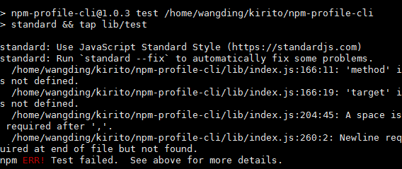

npm-profile-cli
---------------

A minimal CLI for taking actions against your npmjs.com profile.  Is a
wrapper around the `npm-profile` library.

针对您的npmjs.com个人资料采取行动的最小CLI。是npm-profile图书馆的包装。

```
npm-profile <cmd> <args>

Commands(命令):

.command方法有三个接口

.command(cmd, desc, [builder], [handler])

.command(cmd, desc, [module])

.command(module)
其实它们的用法都差不多，可以把它们都看作传递一个module给yargs，这个module必须导出四个变量
cmd, desc [builder], [handler]，其中builder和handler是方法，另外两个是字符串

  adduser [<username>] [<email>]  adduser a new account  //添加一个新账户
  login [<username>]              login to an existing account      //登录到现有帐户
  token [create|list|delete]      create and remove authentication tokens     //创建和删除身份验证令牌       
  get [<property>]                get the value of a profile property       //获取配置文件属性的值
  set <property> <value>          set the value of a profile property       //设置配置文件属性的值
  2fa [status|enable|disable]     control two factor authentication for this   
                                  account                         [aliases: tfa]  //控制此帐户的双因素身份验证
  2fa status(状态)         get the status of 2fa for the current login         //得到当前登录的2fa的现状
  2fa disable(禁用)        disable 2fa for the current login             //禁用2fa当前登录
  2fa enable <mode>(使用模式)    enable 2fa for the current login        //使2fa当前登录 
    <mode> can be one of(两种模式):
      auth-only - Require two-factor authentication only when logging in  //只有在登录时才需要双因素身份验证。
      auth-and-writes - Require two-factor authentication when logging in AND when publishing  //在登录和发布时需要双因素身份验证


Options(选项):
  --config(配置)  the npmrc to read/write your configuration from/to              
                                     [string] [default: "/Users/rebecca/.npmrc"]    //npmrc的读/写你的配置的写入(string类型)
  --registry(注册表)  the registry to talk to                            [string]   //要处理的注册表(string类型)
  --otp(身份认证系统)      a one time password                          [string]     //一次性密码(string类型)
  --help      Show help                                                [boolean]    //显示帮助(boolean类型)
```

## API
### os
os模块，可以用来获取操作系统相关的信息和机器物理信息，例如操作系统平台，内核，cpu架构，内存，cpu，网卡等信息。
<!-- eslint-disable no-unused-vars -->

```js
const os = require('os');
```

### path
path模块提供了一些工具函数，用于处理文件与目录的路径。
<!-- eslint-disable no-unused-vars -->

```js
const path = require('path')  
```

### bluebird
bluebird提供了一个非常有用的功能来promise化不返回promise的模块。比如，promise化fs模块，只需要简单地require bluebird模块和一个被promise化的fs模块。
<!-- eslint-disable no-unused-vars -->

```js
 const Bluebird = require('bluebird') 
```

### log
nodejs默认的采用是morgan的日志系统，一般显示的结果都是在控制台输出，当重启服务器的时候，这些信息就会丢失，无法长久保存，因此，我们考虑采用新的log机制.
<!-- eslint-disable no-unused-vars -->

```js
const log = require('npmlog') 
```

### yars
yargs是一个npm模块用来完成命令行参数解析
<!-- eslint-disable no-unused-vars -->

```js
const yargs = require('yargs')
```

### npmrc
实现轻松和优雅地切换不同的.npmrc文件的功能
<!-- eslint-disable no-unused-vars -->

```js
const npmrc = require('./') 
```

## mocha自动化测试

